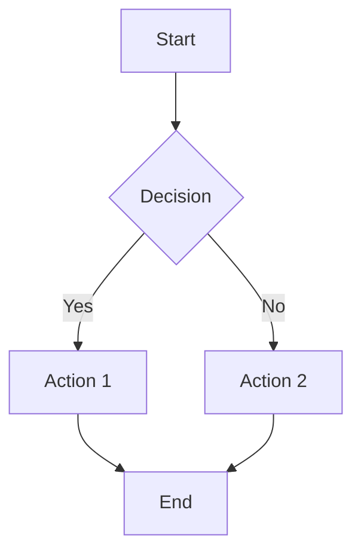

# Sample Markdown Document

This is a **comprehensive** test document for the *MarkdownShared* library.

## Features

### Text Formatting

- **Bold text**
- *Italic text*
- ~~Strikethrough~~
- `inline code`

### Links

[Visit GitHub](https://github.com)

### Task List

- [x] Parser implementation
- [x] Image resolver
- [x] Theme manager
- [ ] Quick Look extension

### Code Block

```swift
import Foundation

struct Greeting {
    let name: String

    func greet() -> String {
        return "Hello, \(name)!"
    }
}
```

### Table

| Feature | Status | Notes |
|---------|--------|-------|
| GFM Tables | Done | Full support |
| Strikethrough | Done | ~~example~~ |
| Task Lists | Done | See above |

### Blockquote

> "The best way to predict the future is to invent it."
> — Alan Kay

### Math (KaTeX)

Inline math: $E = mc^2$

Display math:

$$\int_{-\infty}^{\infty} e^{-x^2} dx = \sqrt{\pi}$$

### Mermaid Diagram



### Images


### Horizontal Rule

---

*End of sample document.*
